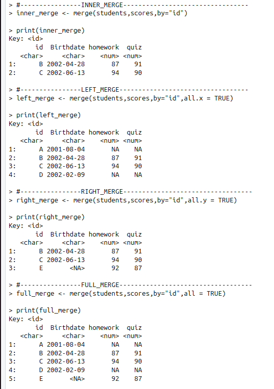

# **Task Summary**

There are three Test to complete

**1)- Easy Test**

In Easy Test, we use the merge() function to perform four types of merges.
\


**2)- Medium Test** In a medium test, make a function that will merge tables x and y and then merge this combined table with another table z.

load("./data/students_data.rda")

load("./data/scores_data.rda")

load("./data/rollno_data.rda")

result\<-merge_three_tables(students,scores,rollno,first_merge = "full_merge",second_merge = "full_merge") print(result)

\
\


**3)- Hard Test** In a hard test, make a function of create.DB.map, multi.merge and visualize.DB.map. \## Installation

Install the package directly from GitHub using `devtools`:

``` r
# Install devtools if not already installed
install.packages("devtools")

# Install DBmaps from GitHub
devtools::install_github("Divendra2006/DBmaps_R", subdir = "hard_solution/DBmaps", build_vignettes = TRUE)
```
